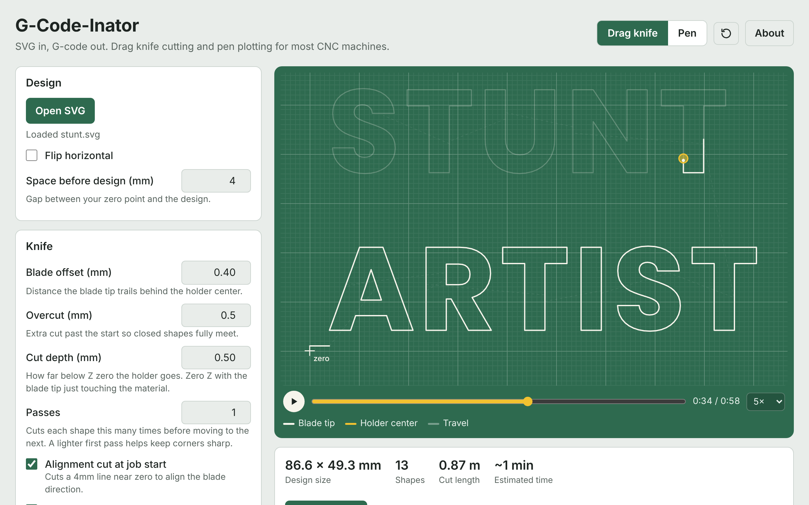

# G-Code-Inator

SVG in, G-code out. Drag knife cutting and pen plotting for most hobby CNC machines.

G-Code-Inator converts SVG drawings into G-code for drag knife cutting and pen plotting. The generated files are designed to work with GRBL, FluidNC, grblHAL and most other hobby CNC controllers.

It runs entirely in the browser. **[Try it live →](https://daviddarts.github.io/gcodeinator/)**

## Drag knife

A drag knife works like a shopping cart caster wheel, trailing behind its central pivot so the cutting tip lags behind the machine head. Unadjusted toolpaths force this trailing tip to round off sharp corners and leave gaps where cuts close. This converter translates SVG vectors into G-code with automatic swivel loops and overcut extensions, producing sharp corners and clean, complete cutouts.

Calibration cuts a row of test shapes, changing one setting between them, to dial in a new blade or material.

## Pen

Converts SVG vectors into G-code for pen plotting, with full support for multi-color drawings. Paths are grouped and plotted sequentially by stroke color, with automated pauses for swapping pens between colors. At each pen change, the machine lowers to paper height so the new pen can be seated without re-zeroing Z.

## License

MIT License © 2026 David Darts. See [LICENSE](LICENSE).
